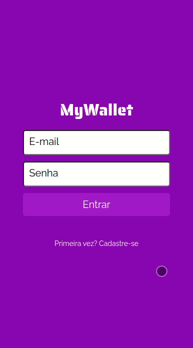

# My Wallet

    

/)

## About

Check how you spend your money keeping track of your transactions

- Sign Up
- Login
- List all your financial events
- Add expense
- Add revenue

## Technologies
    Here are some of the technologies used to build this project

  
  
  
  

## How to run

1. Clone this repository
2. Clone the back-end repository at https://github.com/Jean-Carlo89/MyWallet-Backend
3. Follow instructions to run back-end at https://github.com/Jean-Carlo89/MyWallet-Backend
4. Install dependencies

   ### `npm i`

5. create a .env with your back-end url like in .env.example
6. Run the front-end with

   ### `npm start`

7. open 
 http://localhost:3000 on your browser
  

